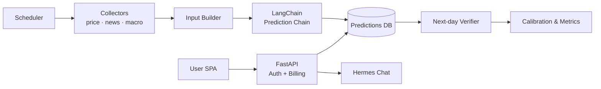

# Aurumers · 黄金市场结构化预测

**An LLM-driven gold-market forecasting platform** — produces *traceable, calibrated* daily predictions, tracks its own accuracy against baselines, and serves it all through a multi-tenant SPA.

基于 LLM 的黄金（SGE / COMEX）行情结构化预测平台：生成**可追溯、带校准**的每日预测，持续自我验证准确率并与基线对比，通过多租户 SPA 对外服务。


<!-- 截图建议放这里 / Add a dashboard screenshot or GIF here — biggest single boost to README appeal:

-->

## ✨ Highlights / 工程亮点

- **Traceable structured predictions** — LLM 输出每日方向 + 概率，可回溯到当时的行情 / 新闻 / 宏观输入
- **Self-calibration & accuracy tracking** — 次日自动校验，长期跟踪准确率、校准度，并与基线模型对比
- **Backtesting & research toolkit** — `scripts/` 内含历史回测、概率回填、horizon 扫描、事件影响分析、趋势模型训练
- **Multi-horizon ensemble signal** — 多周期（1/2/3 月）集成趋势信号 + 持仓顾问
- **Regime detection & flat-gate** — 行情状态识别与"震荡市"过滤，避免无效方向预测
- **Grounded AI chat (Hermes)** — 基于平台数据（行情 / 最新预测 / 准确率 / 新闻）的可追溯问答，非裸 LLM
- **Multi-tenant SaaS backend** — 注册 / 登录、按用户隔离、每日免费 LLM 额度、超额走钱包、兑换码充值、隐藏管理后台
- **Scheduled pipeline** — 内置调度器每日定时跑预测 + 次日校验
- **Tested** — 17 个测试文件覆盖预测链、计费、校准、调度、存储等核心路径

## 🏗 Architecture / 架构



后端 **FastAPI + LangChain**（OpenAI 兼容客户端）+ 原生 `sqlite3` + `argon2` + 服务端会话；前端 **LitElement + Vite** SPA（构建产物由后端静态托管）。

## 🚀 Quick Start / 本地开发

```bash
python -m venv .venv && source .venv/bin/activate
pip install -r requirements.txt
cp .env.example .env          # 填 DASHSCOPE_API_KEY 等；开发可设 MOCK_LLM=1

cd frontend && npm install && npm run build && cd ..   # 前端构建

uvicorn app:app --host 127.0.0.1 --port 8000 --reload  # MOCK_LLM=1 可免真实模型
```

浏览器打开 `http://127.0.0.1:8000/`：落地页 → 注册 / 登录 → `/app` 仪表盘。

## ⚙️ Configuration / 配置

见 [`.env.example`](.env.example)。关键项：`DASHSCOPE_API_KEY`、`MODEL_NAME`、`ADMIN_USERNAME` / `ADMIN_PASSWORD`、`FREE_DAILY_CENTS`（每日免费额度，分）、`COOKIE_SECURE`。

## 📂 Structure / 目录

```
app.py          FastAPI 入口（页面 + /api/*）+ 登录墙中间件 + 计费接入
auth_utils.py   argon2 / 会话 cookie / 鉴权依赖 / 登录限流
billing.py      LLM 用量计费与每日额度
chains/         LangChain 预测/分析链、调度、校准、趋势信号、regime、Hermes 对话
tools/          金价 / 新闻 / 宏观 / 技术指标抓取
scripts/        回测、概率回填、horizon 扫描、事件分析、趋势模型训练
storage/        sqlite 持久化（记录 / 预测 / 用户 / 会话 / 用量 / 兑换码）
prompts/        Prompt 模板
frontend/       LitElement SPA 源码（构建到 static_dist/）
tests/          预测链 / 计费 / 校准 / 调度 / 存储 测试
```

## 🚢 Deployment / 部署

生产以**非 root 用户 + systemd** 运行 `uvicorn`（绑内网端口），前置反向代理终止 HTTPS；反代需正确转发 `X-Forwarded-For`，并以 `--proxy-headers` 启动 uvicorn（登录墙据真实客户端 IP 判定）。

> 真实部署主机、域名、密钥、数据库与用户数据均**不包含**在本仓库中。
